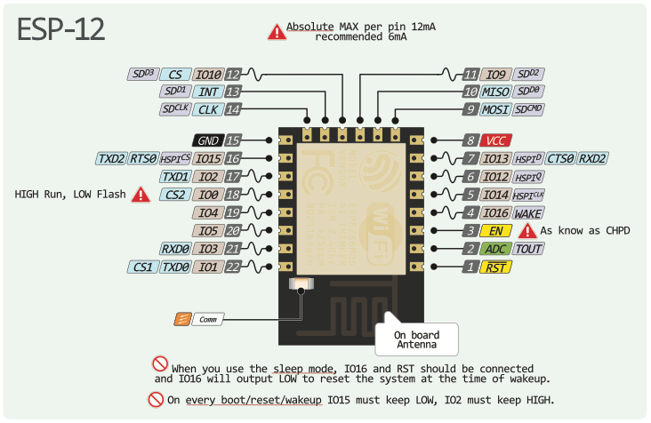

# ESPVario
Simple PPG variometer, CHT, EGT and RPM display. Of course not working yet... :construction: :smile:

## ESP8266 connections

http://www.esp8266.com/wiki/doku.php?id=esp8266_gpio_pin_allocations

| Function | ESP pin | 
| ------ | ------ |
| MISO  | GPIO 12 |
| MOSI  | GPIO 13 |
| SCK | GPIO 14 |
| CS1 EGT | GPIO 0  |
| CS2 CHT | GPIO 2  |
| CS3 SD| GPIO 15 |
| SDA | GPIO 4 |
| SCL | GPIO 5 |
| RPM | GPIO 16 |
|Vario out|GPIO 1|
|Battery V|TOUT/ADC|
|GPS|GPIO 3|
