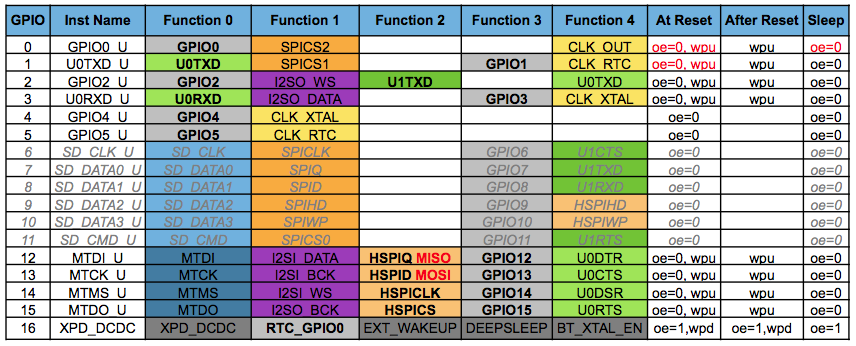

# ESPVario
Simple PPG variometer, CHT, EGT and RPM display.

## ESP8266 connections

| Function | ESP pin | 
| ------ | ------ |
| MISO  | GPIO 12 |
| MOSI  | GPIO 13 |
| SCK | GPIO 14 |
| CS1 EGT | GPIO 0  |
| CS2 CHT | GPIO 2  |
| CS3 pressure| GPIO 15 |
| SDA | GPIO 4 |
| SCL | GPIO 5 |
| RPM | GPIO 16 |
